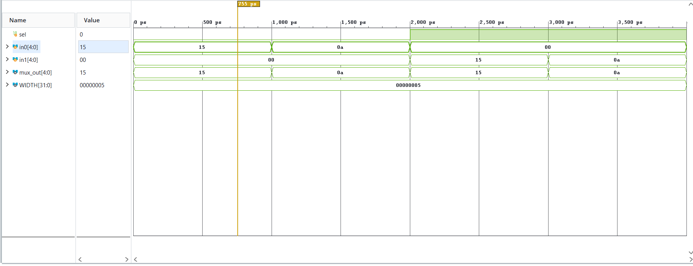
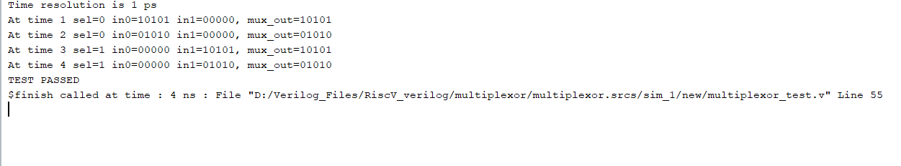
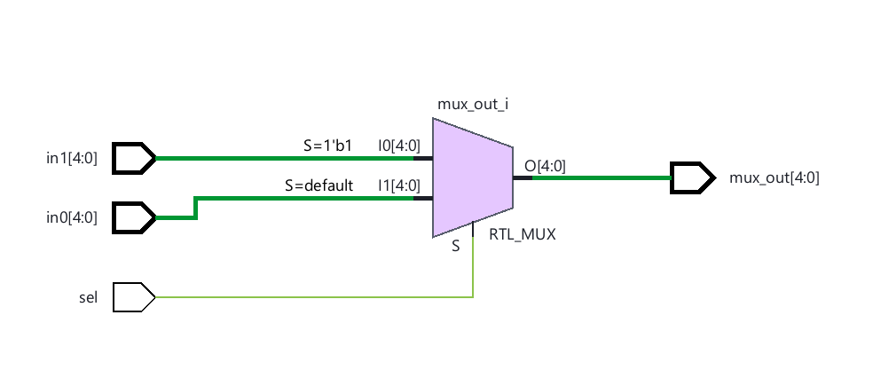
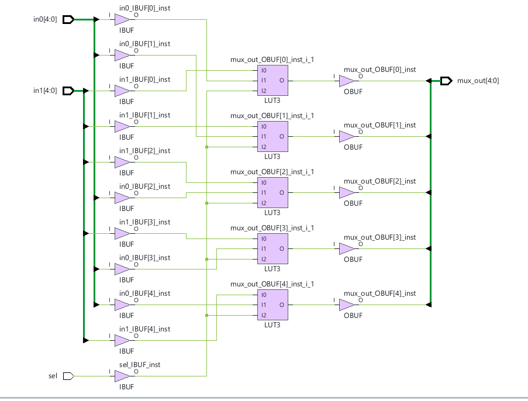

# Parameterized 2-to-1 Multiplexer

The `multiplexor` module is a fully synthesizable, parameterized 2-to-1 digital multiplexer implemented in Verilog HDL (IEEE 1364-2001). It performs combinational bus routing between two parallel data channels (`in0` and `in1`) based on a single-bit selection input (`sel`). With a default parameter width of 5 bits matching RISC-V register address fields, this module provides low-latency datapath steering essential for instruction decoding, ALU operand routing, and register writeback multiplexing across FPGA and ASIC architectures.

## File Header

```text
// File name   : multiplexor.v
// Title       : Parameterized 2-to-1 Multiplexer
// Project     : Verilog Works
// Created     : 2026-10-08
// Description : Synthesizable parameterized 2-to-1 bus multiplexer with clean combinational decoding
```

## Overview

In digital processors and datapath controllers, multiplexers are primary routing elements used to arbitrate data buses and steer operands between functional units. This module provides parameterized bus width scaling (defaulting to 5 bits) and single-cycle, zero-latency combinational routing.

The implementation utilizes modern Verilog-2001 syntax with complete branch coverage to prevent inadvertent latch inference. When synthesized targeting FPGA architecture, the module efficiently maps to look-up table (LUT) primitives, minimizing gate propagation delay and silicon area.

### Digital Design Principles Utilized

- **Combinational Bus Multiplexing**: Output updates instantaneously in response to changes on input buses or the selection line.
- **Hardware Parameterization**: Configurable bit width (`WIDTH`) allows direct reuse across control datapaths, instruction fields, and memory addresses.
- **Complete Sensitivity List**: Implementation uses `always @*` to capture all input dependencies, preventing simulation-synthesis mismatches.
- **Deterministic Hardware Mapping**: Purely combinational logic synthesizes into parallel 3-input look-up tables (`LUT3`) without feedback loops, storage registers, or transparent latches.

---

## Features

- **Verilog-2001 Synthesizable RTL**: Standards-compliant, highly portable register-transfer level code.
- **Parameterized Data Width**: Scalable `WIDTH` parameter (default `5`, suitable for 32-register RISC-V indexing).
- **Glitch-Free Combinational Steering**: Single-level logic decoding delivers minimal propagation delay.
- **Zero Latch Inference**: Fully specified conditional branches guarantee complete combinational synthesis.
- **Self-Checking Testbench**: Automated verification harness validating both multiplexer channels with cycle-accurate assertion checks.

---

## Architecture

The module routes `in1` to `mux_out` when `sel == 1'b1`, and routes `in0` to `mux_out` when `sel == 1'b0`.

```text
                     ┌───────────────────────────────────┐
                     │            multiplexor            │
                     │          (WIDTH-bit MUX)          │
                     │                                   │
      in0[WIDTH-1:0] ════╡0                                  │
                     │   Combinational Steering Logic    ╞════► mux_out[WIDTH-1:0]
      in1[WIDTH-1:0] ════╡1                                  │
                     │                                   │
                sel ─────┴─► [S] Select Line             │
                     └───────────────────────────────────┘
```

### Datapath & Control Flow

1. **Inputs**: Two parallel data buses (`in0`, `in1`) of bit-width `WIDTH` and a 1-bit control line (`sel`) enter the module boundary.
2. **Control & Decoding**: The selection line `sel` evaluates the boolean condition within the combinational evaluation block.
3. **Datapath Routing**: When `sel == 1'b1`, the bit-slice corresponding to `in1` is propagated directly to `mux_out`; when `sel == 1'b0`, `in0` is propagated.
4. **Outputs**: Output bus `mux_out[WIDTH-1:0]` continuously reflects the selected input channel.

---

## Module Hierarchy

| Module Name | Type | Purpose | Source File |
|-------------|------|---------|-------------|
| `multiplexor` | Top / DUT | Synthesizable parameterized 2-to-1 multiplexer | [`multiplexor.v`](multiplexor.v) |
| `multiplexor_test` | Testbench | Verification harness and self-checking stimulus | [`multiplexor_test.v`](multiplexor_test.v) |

---

## Interface (Ports & Parameters)

### Parameters

| Parameter | Type | Default Value | Description |
|-----------|------|---------------|-------------|
| `WIDTH` | `integer` | `5` | Bit width of input data buses (`in0`, `in1`) and output bus (`mux_out`) |

### Port List

| Port | Direction | Width | Type | Polarity / Trigger | Description |
|------|-----------|-------|------|--------------------|-------------|
| `sel` | Input | `1` | `wire` | Level | Select control line (`0` routes `in0`, `1` routes `in1`) |
| `in0` | Input | `WIDTH` | `wire` | Level | Primary parallel data input channel 0 |
| `in1` | Input | `WIDTH` | `wire` | Level | Secondary parallel data input channel 1 |
| `mux_out` | Output | `WIDTH` | `reg` | Level (Combinational) | Selected parallel data output bus |

---

## RTL Implementation Details

### Sequential vs. Combinational Separation

The design is purely combinational and modeled using an `always @*` procedural block:

```verilog
always @* begin
    if (sel)
        mux_out = in1;
    else
        mux_out = in0;
end
```

### Assignment Discipline

- Blocking assignments (`=`) are used exclusively throughout the combinational evaluation block to ensure immediate sequential evaluation without scheduling race conditions.

### Defensive Coding & Latch Prevention

- Every execution path through the conditional evaluation is fully specified with a paired `if` and `else` branch.
- No storage elements or latches are inferred because `mux_out` is assigned under all possible logic states of `sel`.

---

## Verification

The verification suite is implemented in [`multiplexor_test.v`](multiplexor_test.v) as an automated self-checking testbench.

### Testbench Architecture

- **Timing Granularity**: 1 ns step delays (`#1`) between stimulus applications to evaluate combinational propagation.
- **DUT Instantiation**: Instantiates the DUT with default parameterization (`WIDTH = 5`).

### Stimulus Applied

1. **Channel 0 Verification (Test 1)**: `sel = 0`, `in0 = 5'h15` (`10101b`), `in1 = 5'h00` &rarr; verifies `mux_out == 5'h15`.
2. **Channel 0 Verification (Test 2)**: `sel = 0`, `in0 = 5'h0A` (`01010b`), `in1 = 5'h00` &rarr; verifies `mux_out == 5'h0A`.
3. **Channel 1 Verification (Test 3)**: `sel = 1`, `in0 = 5'h00`, `in1 = 5'h15` (`10101b`) &rarr; verifies `mux_out == 5'h15`.
4. **Channel 1 Verification (Test 4)**: `sel = 1`, `in0 = 5'h00`, `in1 = 5'h0A` (`01010b`) &rarr; verifies `mux_out == 5'h0A`.

### Monitoring & Self-Checking

A procedural `expect` task verifies the output against expected values:

```verilog
task expect;
    input [WIDTH-1:0] exp_out;
    if (mux_out !== exp_out) begin
        $display("TEST FAILED");
        $display("At time %0d sel=%b in0=%b in1=%b mux_out=%b",
            $time, sel, in0, in1, mux_out);
        $display("mux_out should be %b", exp_out);
        $finish;
    end
    else begin
        $display("At time %0d sel=%b in0=%b in1=%b, mux_out=%b",
            $time, sel, in0, in1, mux_out);
    end
endtask
```

---

## Simulation Results

### Timing Waveforms



*Figure 1: Behavioral simulation waveform showing instantaneous response on `mux_out` across input data changes under `sel = 0` (0–2000 ps) and `sel = 1` (2000–4000 ps).*

### Console Verification Logs



*Figure 2: Vivado simulator console log displaying cycle-accurate verification with zero failures and successful `TEST PASSED` completion at 4 ns.*

---

## Schematics

### Elaborated RTL Schematic



*Figure 3: AMD Vivado elaborated design schematic showing inferred generic multiplexer macro (`RTL_MUX`) with data buses `in0[4:0]`, `in1[4:0]`, and selection input `sel`.*

### Synthesized Gate-Level Design



*Figure 4: Post-synthesis technology schematic targeting FPGA fabric, illustrating optimal mapping to 5 parallel 3-input look-up tables (`LUT3`) with dedicated I/O buffers (`IBUF`, `OBUF`).*

---

## How to Run Simulation

### Using Icarus Verilog (iverilog)

```bash
# Compile design and testbench
iverilog -g2001 -o multiplexor_sim.out multiplexor.v multiplexor_test.v

# Execute simulation
vvp multiplexor_sim.out
```

### Using AMD Vivado (xsim batch mode)

```bash
# Analyze Verilog sources
xvlog multiplexor.v multiplexor_test.v

# Elaborate testbench snapshot
xelab multiplexor_test -s multiplexor_snapshot

# Run simulation to completion
xsim multiplexor_snapshot -R
```

---

## Technologies

- **Hardware Description Language**: Verilog HDL (IEEE 1364-2001)
- **RTL Synthesis & Static Timing Analysis**: AMD Vivado Design Suite
- **Logic Simulator**: AMD Vivado Simulator (XSim) / Icarus Verilog
- **Target Technology**: FPGA / ASIC-oriented combinational LUT logic (`LUT3`)

---

## Contributing

Contributions focusing on parameterization, testbench automation, formal assertions, or FPGA implementation are welcome:

1. Fork the repository
2. Create a feature branch (`git checkout -b feature/improvement`)
3. Commit your changes
4. Verify simulation passes with 0 errors
5. Submit a Pull Request

---

&copy; Chethan Aithal. All rights reserved.

## Author

**Chethan Aithal**
