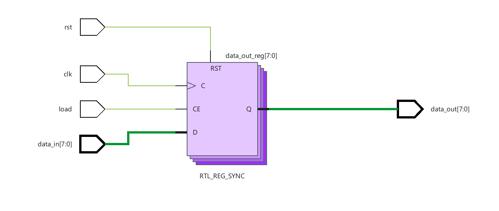
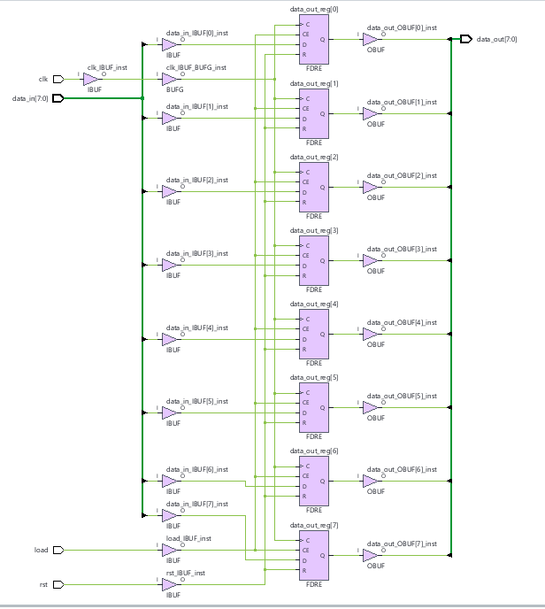
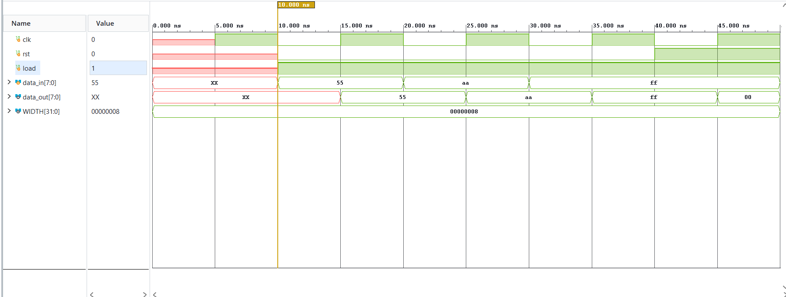
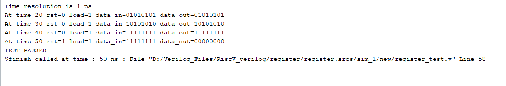

# Parameterized Register

> Synthesizable parameterized N-bit synchronous register with synchronous active-high reset and load enable in Verilog HDL.

## Overview

This project implements a parameterized N-bit synchronous storage register. The design allows configuring data width through a top-level parameter (`WIDTH`, default 8 bits) and provides precise control over register updates using a synchronous load enable signal and a synchronous active-high clear/reset signal.

The design is verified through a self-checking testbench and demonstrated through RTL elaboration, logic synthesis, and post-synthesis schematic mapping in AMD/Xilinx Vivado.

## Key Features

- **Parameterized Data Width**: Configurable bit width via parameter `WIDTH` (defaults to 8 bits).
- **Synchronous Active-High Reset**: Prioritized clear mechanism synchronous to clock edge.
- **Synchronous Load Enable**: Gated data loading to retain stored state when inactive.
- **Fully Synthesizable RTL**: Directly infers dedicated synchronous flip-flop primitives (`FDRE`) with clock enable and synchronous reset.
- **Self-Checking Testbench**: Automated verification task validating output correctness against expected data vectors.

## Architecture

The register samples the input data `data_in` on the rising edge of `clk` when `load` is asserted and `rst` is deasserted. When `rst` is asserted, the register resets its output `data_out` to all zeros regardless of `load`. When `load` is deasserted and reset is inactive, the register maintains its previous state.



*Figure 1: RTL elaborated schematic showing the parameterized synchronous register block (`RTL_REG_SYNC`) with control inputs (`clk`, `rst`, `load`) and data bus interfaces.*

## RTL Design

### Module Structure

| Module | File | Role |
|--------|------|------|
| `register` | [`register.v`](register.v) | Core parameterized register design with synchronous reset and load control |
| `register_test` | [`register_test.v`](register_test.v) | Self-checking simulation testbench validating functional and reset behavior |

### Parameters

| Parameter | Type | Default Value | Description |
|-----------|------|---------------|-------------|
| `WIDTH` | `integer` | `8` | Width of the data input and output buses in bits |

### Interface Signals

| Signal | Direction | Width | Description |
|--------|-----------|-------|-------------|
| `clk` | Input | 1 bit | System clock signal (active on rising edge) |
| `rst` | Input | 1 bit | Synchronous active-high reset (clears output to zero) |
| `load` | Input | 1 bit | Synchronous load enable (latches `data_in` into register) |
| `data_in` | Input | `WIDTH` | Parallel data input bus |
| `data_out` | Output | `WIDTH` | Registered parallel data output bus |

## Functional Operation

The sequential logic operates strictly on the positive edge of `clk`:

1. **Synchronous Reset (Highest Priority)**:
   ```verilog
   if (rst)
       data_out <= 0;
   ```
   When `rst` is asserted high on a rising clock edge, `data_out` is immediately driven to `0`, taking precedence over `load`.

2. **Synchronous Load Enable**:
   ```verilog
   else if (load)
       data_out <= data_in;
   ```
   When `rst` is low and `load` is high, `data_in` is transferred to `data_out` on the clock edge.

3. **Data Hold / Retain**:
   ```verilog
   else
       data_out <= data_out;
   ```
   When both `rst` and `load` are low, the register recirculates its current state, preserving stored data.

## Synthesis & Implementation

The design synthesizes into hardware technology primitives without inferred latches or extraneous logic. For an 8-bit configuration (`WIDTH = 8`), synthesis maps the design to:

- **8x FDRE Primitives**: D-type flip-flops with clock enable (`CE`), synchronous reset (`R`), clock (`C`), and data input (`D`).
- **Input/Output Buffers**: Standard I/O buffers (`IBUF`, `OBUF`) and a global clock buffer (`BUFG`).



*Figure 2: Synthesized gate-level schematic showing mapping to 8 parallel `FDRE` primitives with shared clock, enable, and reset nets.*

## Verification & Simulation

The testbench (`register_test.v`) verifies sequential loading of test patterns (`8'h55`, `8'hAA`, `8'hFF`) followed by synchronous reset assertion (`rst = 1, load = 1`) to ensure reset priority.

### Simulation Waveform



*Figure 3: Behavioral simulation waveform displaying clock transitions, synchronous data capture on `load`, and output clearance upon `rst` assertion.*

### Console Verification Output

The self-checking testbench reports cycle-by-cycle comparisons and confirms test success via `$display`:



*Figure 4: Vivado simulator console log showing verified time steps and successful `TEST PASSED` completion.*

## Verilog Concepts Demonstrated

- Parameterized module instantiation (`#(.WIDTH(WIDTH))`)
- Synchronous sequential design (`always @(posedge clk)`)
- Multi-level control priority (synchronous reset overriding load enable)
- Non-blocking assignments (`<=`) in sequential blocks
- Self-checking testbench development with parameterized tasks and `$display`

## Repository Contents

```text
Parameterized_Register/
├── README.md                      # Project documentation and analysis
├── register.v                     # Parameterized register RTL source
├── register_test.v                # Self-checking testbench
├── elaborated_schematic.png       # RTL elaborated design schematic
├── synthesized_schematic.png      # Synthesized gate-level schematic (FDRE primitives)
├── simulation_waveform.png        # Functional simulation waveform
└── simulation_console_log.png     # Simulator log output showing test pass
```

## Tools / Technologies

- **Language**: Verilog HDL (IEEE 1364-2001)
- **EDA Tool**: AMD/Xilinx Vivado
- **Simulator**: Vivado Simulator (XSim)
- **Synthesis Target**: FPGA-oriented RTL (inferred `FDRE` primitives)
